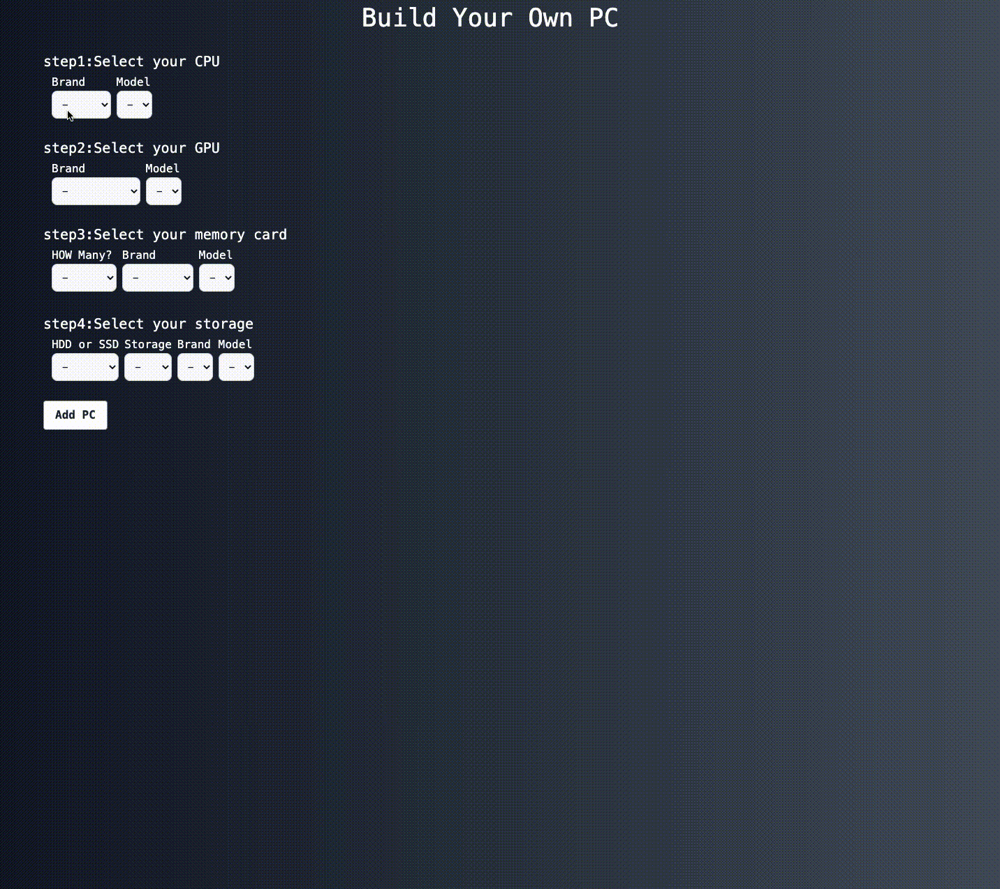

## **Computer Builder**

 

### **概要**
Recursionの課題で、APIで取得したデータを加工、表示するアプリです。
コンピューターの各パーツ（CPU/GPU/RAM/HDD・SSD）を選択することで、この構成がゲーム用・作業用にどれだけ適しているかをベンチマークとして表示します。

 

### **工夫した点**
1.TypeScript×Vueによる実装を行った

Typescript、Vueにて開発を行いました。
コンポーネントを分割しわかりやすい開発を意識しました。

2.Jestでユニットテストを行った

Jest、Vitest, Vue-test-utilisを使用し、テストを行いました。

 

### **ソースコード**
https://github.com/setodeve/Computer-Builder

 

### **URL**
https://setodeve.github.io/Computer-Builder/

